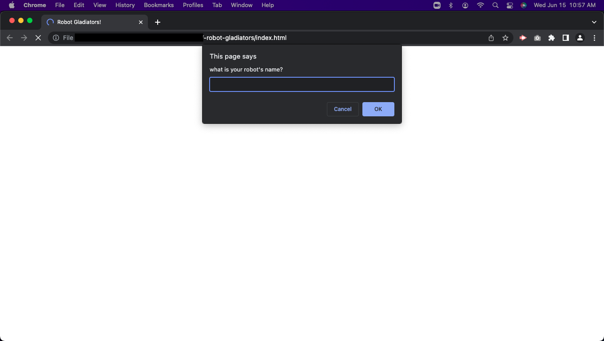
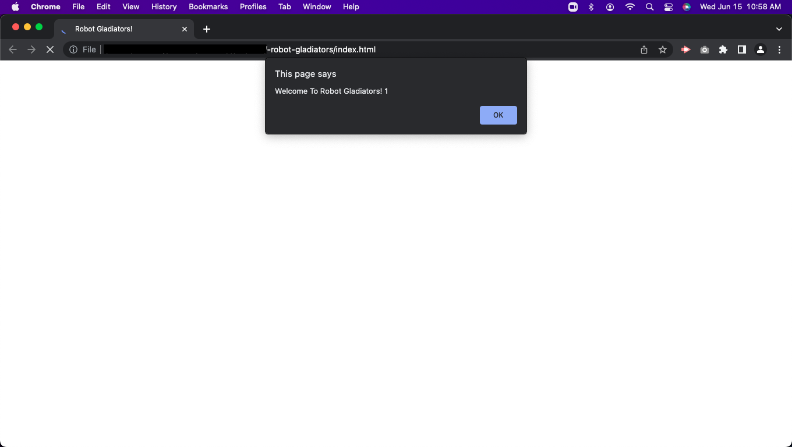

# -robot-gladiators

## Purpose
In this project we learn to use JavaScript by creating a game using basic functions and objects. The user is prompted for a character’s name and then proceeds to ask if you will fight or skip. after making a choice, a random amount of points are withdrawn from both the user and the computer, until one looses.

## Instructions
download or clone the file. Open the HTML file on a Google Chrome browser. You will be prompted by the browser to name your fighter, followed by more prompts. Follow the prompts instructions until you or the computer wins. 

## Website Link
https://itzamary.github.io/-robot-gladiators/

## Image

