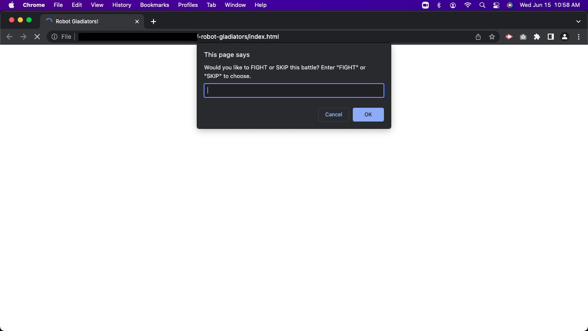

# -robot-gladiators

## Purpose
In this project we learn to use JavaScrpt by creating a game that propmpts a user for a charachters name and then proceeds to ask if you will fight or skip. after making a choice a random amount of points are withdrawn from each fighter and Roborto the AI, untill one looses. 

## Website Link
https://itzamary.github.io/-robot-gladiators/

## Image

